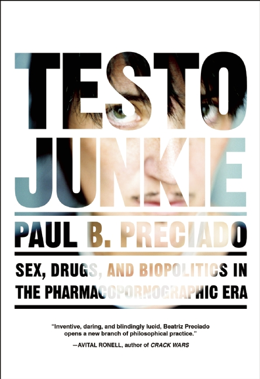

# TESTO READINGS

TESTO JUNKIE: SEX, DRUGS, AND BIOPOLITICS IN THE PHARMACOPORNOGRAPHIC ERA is a book by Paul B. Preciado on the topics of new manifestations of gender identity though the modern paranoia of institutional control over body and disrourse. A historic exploration and experimental strategies of dealing with the gendered self, even at the expense of own well being. The

This website is a chapter-by-chapter review of the content, done mostly on the fly with little or no analysys of the content as not to infer reader with own opinions. Reader is the writer and thus it is your obligation to form the optinion, either based on the content presented here, or on the content of the original book.

The website was handcoded with no frameworks and the brutalist approach was the primary purpose of this exersise. The form trumps the content and complaining about lackluster content means missing the point.
